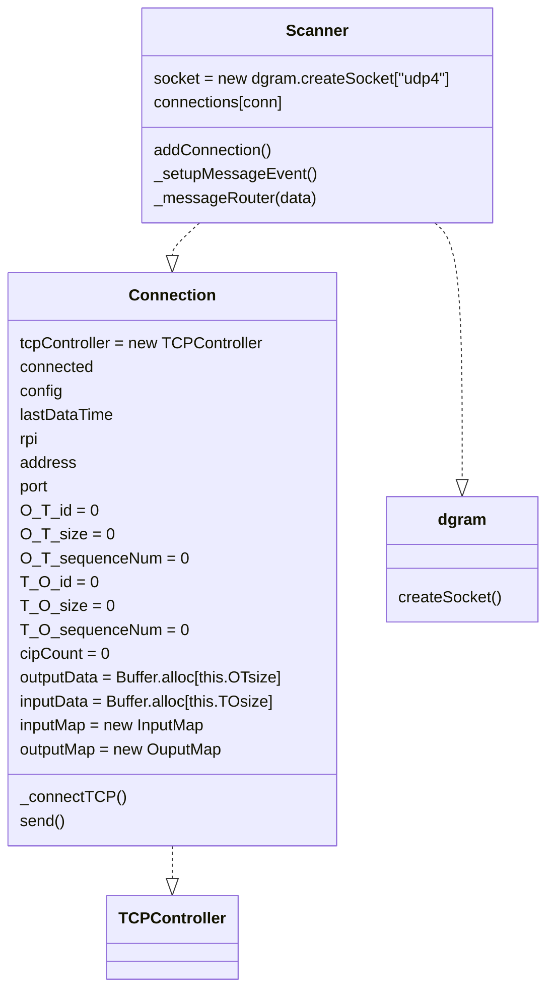

# EtherNet/IP

## Diagram

```mermaid
classDiagram
Scanner ..|> Connection
Scanner ..|> dgram
Scanner:socket = new dgram.createSocket["udp4"]
Scanner:connections[conn]
Scanner:addConnection()
Scanner:_setupMessageEvent()
Scanner:_messageRouter(data)

Connection ..|> TCPController
Connection:tcpController = new TCPController
Connection:connected
Connection:config
Connection:lastDataTime
Connection:rpi
Connection:address
Connection:port
Connection:O_T_id = 0
Connection:O_T_size = 0
Connection:O_T_sequenceNum = 0

Connection:T_O_id = 0
Connection:T_O_size = 0
Connection:T_O_sequenceNum = 0

Connection:cipCount = 0
Connection:outputData = Buffer.alloc[this.OTsize]
Connection:inputData = Buffer.alloc[this.TOsize]
Connection:inputMap = new InputMap
Connection:outputMap = new OuputMap

Connection:_connectTCP()
Connection:send()

dgram:createSocket()
```

